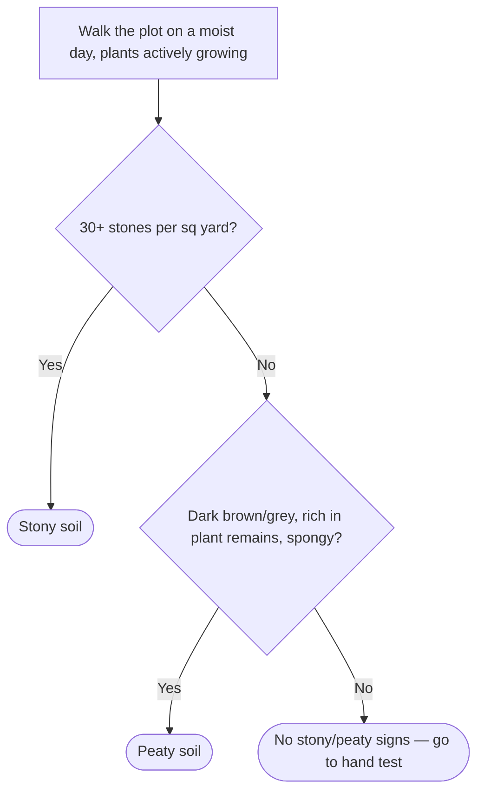
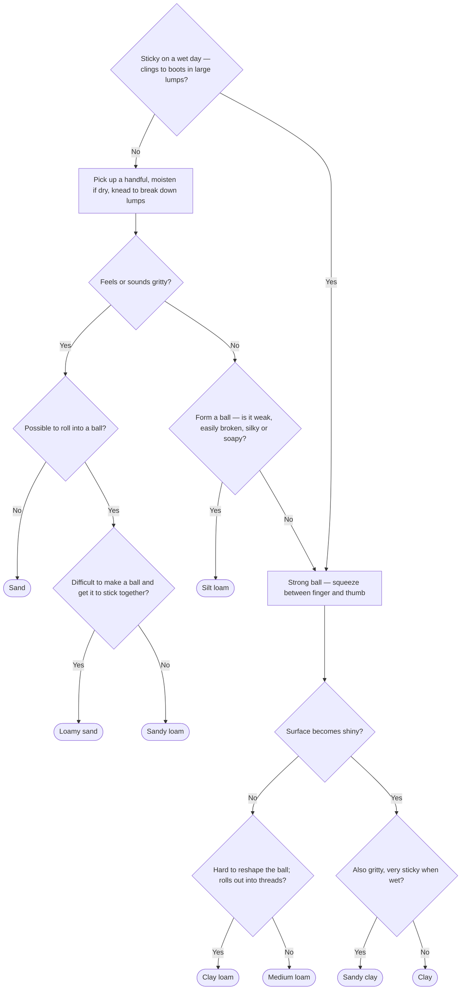
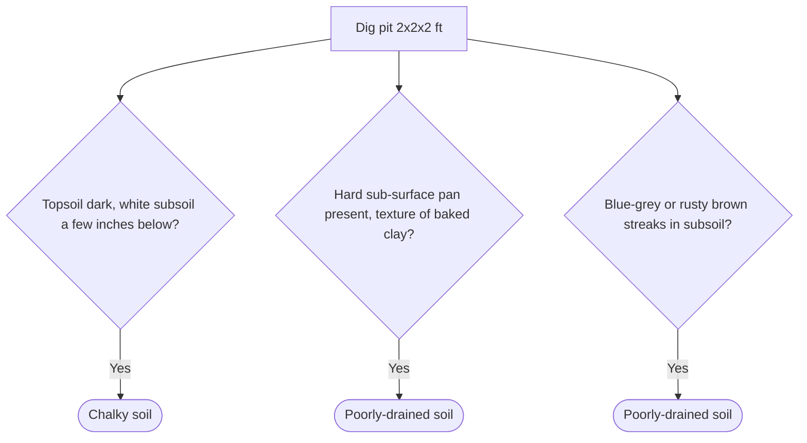
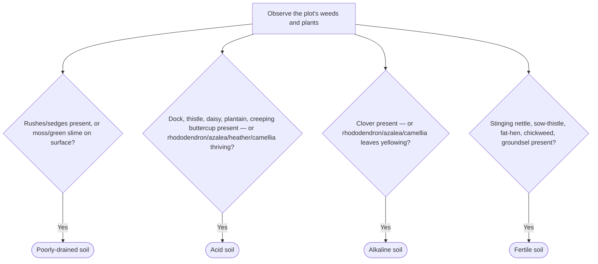

# Putting a Name to Your Soil — Decision Trees

Four independent trees: walkover test, hand (texture) test, pit test, and weed/pH indicators.

## Walkover test

## Hand test (texture)

## Pit test

Dig a pit 2 ft × 2 ft × 2 ft on a moist day. The three checks are independent — any "Yes" gives its result.

## Weeds & pH indicators

Read directly from what's already growing — each check is independent.

